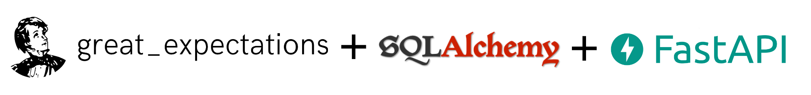

Automatically create SQL tables and REST routes for your tables just by defining data dictionaries


# Motivation
Defining data dictionaries (or data quality tests), table schemas and API response models and routes for consuming these tables involves a lot of repetitive and overlapping definitions. For example let's say we have an **employees** table:

**Data dictionary**

<table>
<th>Column Name</th>
<th>Data Type</th>
<th>Constraints</th>
<th>Required/Optional</th>

<tr>
    <td>ID</td>
    <td>Integer</td>
    <td>Has to be increasing number</td>
    <td>required</td>
</tr>

<tr>
    <td>Name</td>
    <td>String</td>
    <td>Length has to be up to 50 characters</td>
    <td>required</td>
</tr>

<tr>
    <td>Sex</td>
    <td>String</td>
    <td>Has to be "male" or "female"</td>
    <td>required</td>
</tr>

<tr>
    <td>Age</td>
    <td>Float</td>
    <td>Has to be greater than 0</td>
    <td>required</td>
</tr>

</table>

*Note: Since writing a `great_expectations` suite (JSON) would take too much space for this example, expectations are pesented in tabular format.*
<br>
<br>

**Table schema**

```python
from sqlalchemy import Table, Column, Integer, String, Float

employee = Table(
    "employee",
    metadata,

    Column("id", Integer, primary_key=True, autoincrement=True),
    Column("name", String(50), nullable=False),
    Column("sex", String(20), nullable=False),
    Column("age", Float, nullable=False),
)
```
<br>

**API response model**

```python
from pydantic import BaseModel

class Employee(BaseModel):
    id: int
    name: str
    sex: str
    age: float
```
<br>

**API routes**
```python
from typing import List
from fastapi import APIRouter

router = APIRouter()

@router.get("/employees/", response_model=List[Employee])
async def get_employees():
    query = employee.select()
    return await database.fetch_all(query)

@router.get("/employees/{id}", response_model=Employee)
async def get_one_employee(id: int):
    query = employee.select().where(employee.c.id == id)
    return await database.fetch_one(query)
```


As you can see, there are 3 different places in the code where we define the same column names, their data types and constraints. This is prone to errors since in case of a single change in data requirements, we have to make sure that all updates are propagated.

Also, creating models and routes for dozens of tables is boring and distracts us from our main (and more interesting) tasks.

